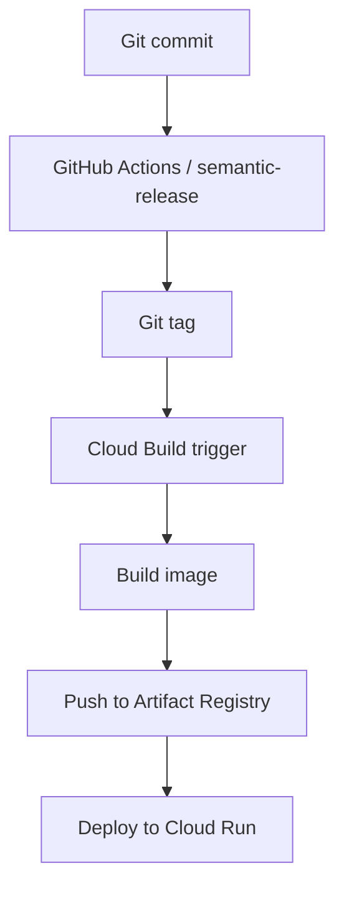

# GCP Deployment Guides

This folder contains the reference material for deploying the project to Google Cloud Run.

## What to use

- [deploy-via-cli.md](deploy-via-cli.md) for a terminal-first setup that is easy to automate and repeat.
- [deploy-via-console.md](deploy-via-console.md) for a Console-only walkthrough with click-by-click instructions.

## Recommended deployment flow

The project is designed around semantic-release tags:

## Quick prerequisites

Before deploying, make sure you have:

- A GCP project with billing enabled
- The required APIs enabled for Cloud Build, Cloud Run, Artifact Registry, and Secret Manager
- An Artifact Registry Docker repository for Cloud Run images
- The Cloud Build service account granted the permissions needed to deploy
- The runtime secrets created in Secret Manager

## Guide summary

- Use the CLI guide when you want a full setup you can script, version, and rerun.
- Use the Console guide when you are setting up the project manually or validating the deployment in the UI.
- Both guides assume the service is deployed to Cloud Run and can be made public with unauthenticated invocations when appropriate.

## Related files

- [deploy-via-cli.md](deploy-via-cli.md)
- [deploy-via-console.md](deploy-via-console.md)
